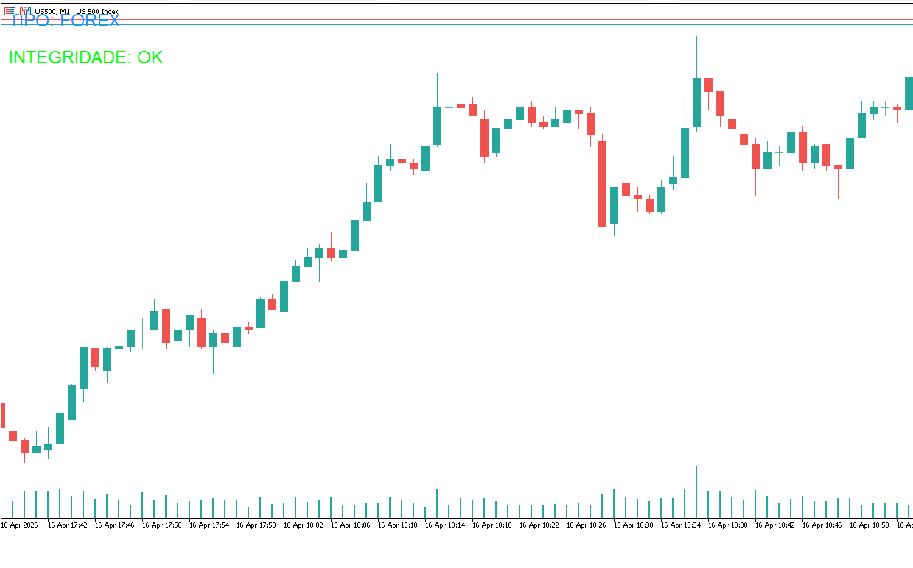
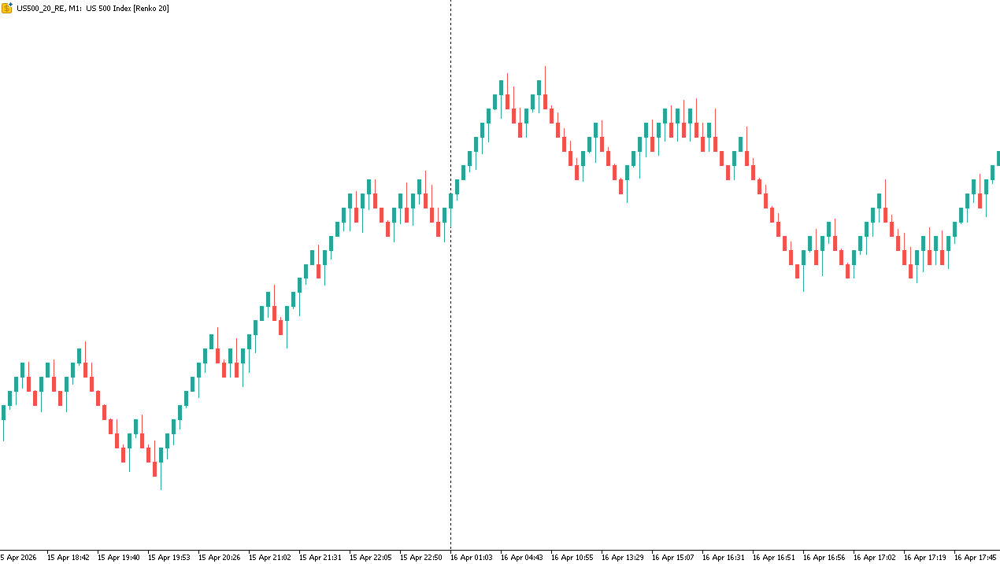
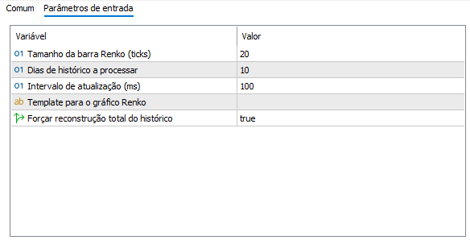

# 💹 RenkoSynthetic EA (v3.06)

**Expert Advisor para MetaTrader 5 (MQL5) para geração de gráficos Renko, publicados em ativos sintéticos, para ativos BOLSA e FOREX**

---

## 📝 Descrição

O **RenkoSynthetic** é um gerador de ativos customizados que transforma o fluxo de ticks de um ativo base (como índices sintéticos ou pares de moedas) em um gráfico de barras Renko.

Diferente de geradores comuns, ele foi otimizado para manter a integridade dos dados mesmo após reconexões ou reinicializações do terminal, utilizando persistência via *Global Variables*.

Além disso, na estrutura `MqlRates` criada para o símbolo sintético com as barras Renko, os campos são utilizados de forma não convencional para armazenar informações adicionais de fluxo:

- `tick_volume` → representa a **agressão de compra**
- `real_volume` → representa a **agressão de venda**
- `spread` → representa o **tempo de duração da barra**

Essa adaptação permite embutir informações de microestrutura diretamente nas barras do gráfico sintético.

### 🖼️ Demonstração Visual

| Ativo Base (Original)                       | Ativo Sintético (Renko Gerado)                                         |
| :------------------------------------------ | :--------------------------------------------------------------------- |
|  |                           |
| *Exemplo do fluxo de ticks original.*       | *Gráfico Renko limpo e padronizado.* **DEVE-SE USAR TEMPO GRÁFICO M1** |

---

## 🚀 Principais Novidades (v3.06)

Esta versão foca em **consistência de fluxo ao vivo** e precisão milimétrica nos timestamps:

- **[C1] Filtro Anti-Double-Count:** Separação lógica entre o fechamento da barra (`last_bar_close_ms`) e o último tick visto (`last_seen_ms`), evitando o acúmulo duplicado de agressão.
- **[C2] Timestamp de Abertura Real:** O `open_time_ms` da barra reflete o primeiro tick real que pertence a ela, garantindo que a duração (spread) seja exata.
- **[C3] Ordem de Acumulação Corrigida:** Inicialização do tempo de abertura antes da contagem de agressão para garantir que o primeiro tick seja computado corretamente.
- **[C4] Persistência Robusta:** Ponto único de saída no processamento incremental para garantir que o estado seja salvo em qualquer cenário, eliminando riscos de dessincronização.

---

## ⚙️ Configurações de Usuário

O EA permite ajustes finos para se adaptar a diferentes volatilidades e necessidades de histórico:

| Parâmetro             | Descrição                                                         |
| :-------------------- | :---------------------------------------------------------------- |
| `InpRenkoSizeTicks`   | Tamanho de cada tijolo Renko em ticks.                            |
| `InpHistoryDays`      | Quantidade de dias para processar na reconstrução inicial.        |
| `InpUpdateIntervalMs` | Frequência de atualização do gráfico em milissegundos.            |
| `InpTemplate`         | Template (.tpl) a ser aplicado automaticamente no gráfico gerado. |
| `InpForceRebuild`     | Força a limpeza e reconstrução total do histórico.                |

> **Print das Configurações:**  
> 

---

## 🛠️ Tecnologias e Lógica Interna

- **Detecção Automática de Ativo:** Identifica se o símbolo é **Forex** ou **Bolsa (Exchange)** para ajustar o modo de cálculo de agressão e flags de ticks.
- **Estimativa de Agressão:**
  - **Exchange:** Baseado em flags reais de `BUY`/`SELL`.
  - **Forex:** Baseado na variação do *Mid-Price* entre ticks.
- **Relógio de Timestamps:** Garante que cada barra tenha um timestamp estritamente crescente, essencial para a plotagem correta no MT5.
- **Gestão de Símbolos:** Cria automaticamente o símbolo com o sufixo `_RE` na pasta `Custom\Renko`.

---

## 📂 Estrutura do Código

O código está organizado em blocos modulares para facilitar a manutenção:

1. **Persistência:** `SaveGlobalVars` e `LoadGlobalVars`
2. **Integridade:** `CheckHistoryIntegrity` valida gaps de preço e timestamps
3. **Processamento:** `ProcessTick` gerencia o loop principal de criação de barras
4. **Interface:** `DrawStatusText` exibe o status de integridade diretamente no gráfico

---

## ✒️ Autor

- **Desenvolvedor:** `#property copyright "Carlos Rincones"`
- **GitHub:** https://github.com/crincones

---

*Este README foi gerado com base na análise técnica do código fonte RenkoSynthetic.mq5 v3.06.*